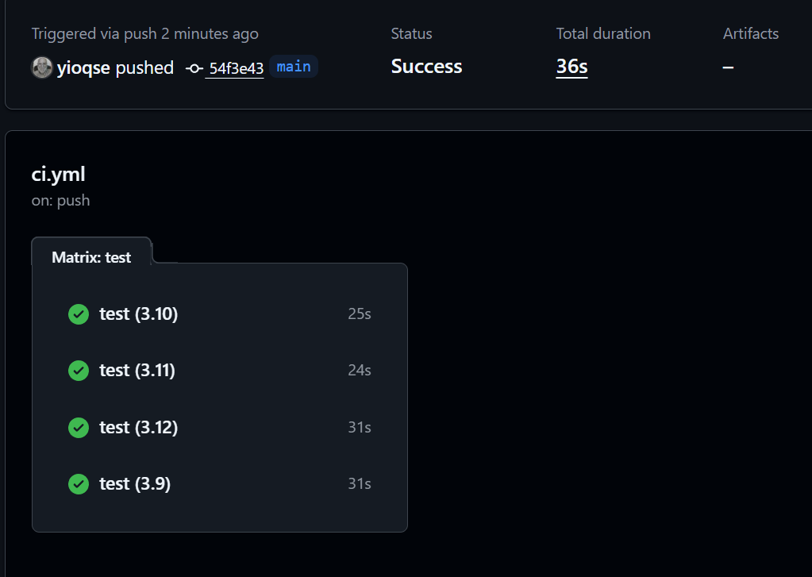

# 📦 Sistema de Inventario Inteligente (Smart Inventory)

[](https://github.com/yioqse/Inventario/actions)

Un sistema modular avanzado para la gestión predictiva de inventarios, integrando visión artificial simulada, bases de datos, análisis de tendencias y un motor de recomendaciones automatizado. Construido bajo los principios de **Clean Architecture**.

## 🚀 Instalación y Ejecución

1. **Clonar y activar entorno virtual:**
```bash
git clone https://github.com/yioqse/Inventario.git
cd Inventario
python -m venv .venv
# En Windows:
.venv\Scripts\activate
```

2. **Instalar dependencias:**
```bash
pip install -r requirements.txt
```

3. **Ejecutar la interfaz web:**
```bash
streamlit run interface/demoStreamlit.py
```

## 📊 Arquitectura
- `services/database/`: Manejo de datos y filtrado (Mock Data).
- `services/vision/`: Detección simulada de inventario (escenarios aleatorios).
- `services/inventory/`: Reglas de negocio, métricas financieras y motor de recomendaciones.
- `services/prediction/`: Modelos matemáticos de demanda y prevención de quiebres de stock.
- `tests/`: Batería completa de pruebas unitarias y de integración bajo estándar AAA.

## ✅ Resultado del Pipeline CI/CD

